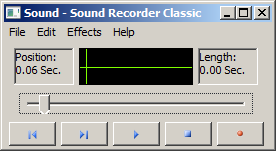

# Sound Recorder Classic
A recreation of Windows 98/XP sound recorder

Dirty as hay project mostly for nostalgic and learning purpose, use at your own risks!
TheDarkTiger 2024

## The idea behind this project

### For me
Basically an excuse to learn how to use IUP.
Playing sound while updating the GUI will be interesting too.
The effects should be easy to implement, but the compressors may be a pain, so firts versions probably will only have fixed params PCM WAV.

### For others
If I finish it, it should be an useable small retro feel tool to record sounds.
Can be useful for a retro distro, react OS, nostalgia on windows 11 or whatever.
Plus, without going too far (the goal is not to make an other Audacity), I can add some new options, effects, compressors, or parameters.

## How to build?
Grab a copy of IUP, install the compiler of your choice, and enjoy.

### For Windows
I dev on Windows7, gcc (mingw64-13.2.0-rev1 msvcrt) and IUP (iup-3.31_Win64_mingw6_lib).

### For Linux
I may take the time to figure out a simple way to do it.
But it should be as easy as using gcc and the linux static package for IUP.

## How to use?
You can't for now.
Well, you can try to compile it yourself (I would be interested to know about it), but it won't do anything by now.
